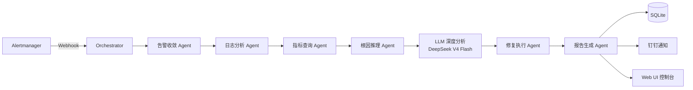

# AutoSRE - 多 Agent 自动化运维排障系统


> 📖 [English Version](docs/README_EN.md) ｜ 📐 [架构设计](docs/architecture.md) ｜ 🔌 [API 文档](docs/api.md)

AutoSRE 是一个基于多 Agent 协作的智能运维排障系统，由 Orchestrator 调度 7 类专职 Agent 完成从告警接收 → 告警收敛 → 根因定位 → 修复执行 → 报告生成的全流程闭环，并集成 LLM 深度分析与自学习机制。

## 核心特性

- 🤖 **7 个协作 Agent** - 告警收敛、日志分析、指标查询、根因推理、修复执行、报告生成、预测性维护，各司其职
- 🧠 **LLM 深度分析** - 集成 DeepSeek V4 Flash，输出根因分析 / 修复步骤 / 预防措施 / 风险评估四维复盘
- 📊 **真实监控集成** - Prometheus 指标采集 + Alertmanager 告警投递 + Grafana 可视化
- 🔮 **预测性维护** - PredictiveAgent 基于历史故障数据预测潜在风险
- 📚 **自学习** - 每次故障处理结果持久化，知识库自动更新，持续提升推理准确率
- 🔐 **安全** - JWT + API Key + RBAC 权限控制
- ⚡ **高性能** - 100 条告警收敛仅 0.0009 秒
- 🐳 **Docker 部署** - Docker Compose 一键编排 8 个服务容器

## 系统架构

告警经 Alertmanager Webhook 进入 AutoSRE 后，由 Orchestrator 以同步流水线方式编排各 Agent 协作完成排障：



> 完整架构说明、Agent 协作时序与数据流图见 [docs/architecture.md](docs/architecture.md)

## 项目结构

```
autosre/
├── agents/                    # 7 类专职 Agent + 核心基础设施
│   ├── base_agent.py          # ABC 统一 Agent 接口
│   ├── orchestrator.py        # 编排器（同步流水线模式）
│   ├── message_bus.py         # 进程内发布-订阅消息总线
│   ├── alert_convergence.py   # 告警收敛 Agent
│   ├── log_analyzer.py        # 日志分析 Agent
│   ├── metric_querier.py      # 指标查询 Agent
│   ├── root_cause.py          # 根因推理 Agent
│   ├── repair_executor.py     # 修复执行 Agent
│   ├── report_generator.py    # 报告生成 Agent
│   ├── predictive_agent.py    # 预测性维护 Agent
│   ├── llm_analyzer.py        # DeepSeek LLM 分析
│   ├── self_learning.py       # 自学习模块
│   └── rbac.py / auth.py      # 权限与认证
├── config/
│   ├── prometheus/            # 抓取配置 + 告警规则
│   ├── alertmanager/          # 告警路由与分组
│   ├── grafana/               # 看板与数据源
│   └── nginx/                 # 反向代理
├── mock-app/                  # 被监控的模拟业务应用
├── scripts/
│   ├── inject_fault.sh        # 故障注入脚本
│   └── benchmark.py           # 性能压测工具
├── templates/                 # 故障复盘报告模板
├── web_ui.html                # Web 控制台
├── api_server.py              # FastAPI 服务入口
├── docker-compose.yml         # 8 服务容器编排
└── main.py                    # CLI 入口
```

## 快速开始

```bash
git clone https://github.com/xiaoxiaoma0201/autosre.git
cd autosre
pip install -r requirements.txt
python api_server.py
```

访问 `http://localhost:9999` 打开 Web 控制台。

## 故障注入演示

通过 `scripts/inject_fault.sh` 一键注入故障，验证全链路自动排障能力：

```bash
./inject_fault.sh cpu-high      # 注入 CPU 打满（持续 30 秒）
./inject_fault.sh redis-down    # 注入 Redis 宕机
./inject_fault.sh mysql-down    # 注入 MySQL 宕机
./inject_fault.sh nginx-down    # 注入 Nginx 宕机
./inject_fault.sh redis-up      # 恢复 Redis（mysql-up / nginx-up 同理）
```

故障经 Prometheus 告警规则捕获 → Alertmanager 分组 → Webhook 投递至 AutoSRE，自动完成根因定位、修复与报告生成，并通过钉钉实时通知。

## 性能基准

`scripts/benchmark.py` 实测数据（本地环境）：

| 场景 | 数据量 | 耗时 |
|------|--------|------|
| 告警收敛 | 100 条 | 0.0009 秒 |
| 缓存写入 | 10000 条 | 0.0039 秒 |
| 缓存读取 | 10000 条 | 0.0013 秒 |

```bash
cd scripts && python benchmark.py
```

## Web UI


Web 控制台提供仪表盘（故障趋势 / 统计卡片）、故障记录、实时指标、报告查看四个面板。

## 文档

- [架构设计](docs/architecture.md) - 系统架构图、Agent 协作时序、数据流
- [API 文档](docs/api.md) - REST API 说明
- [English README](docs/README_EN.md)
