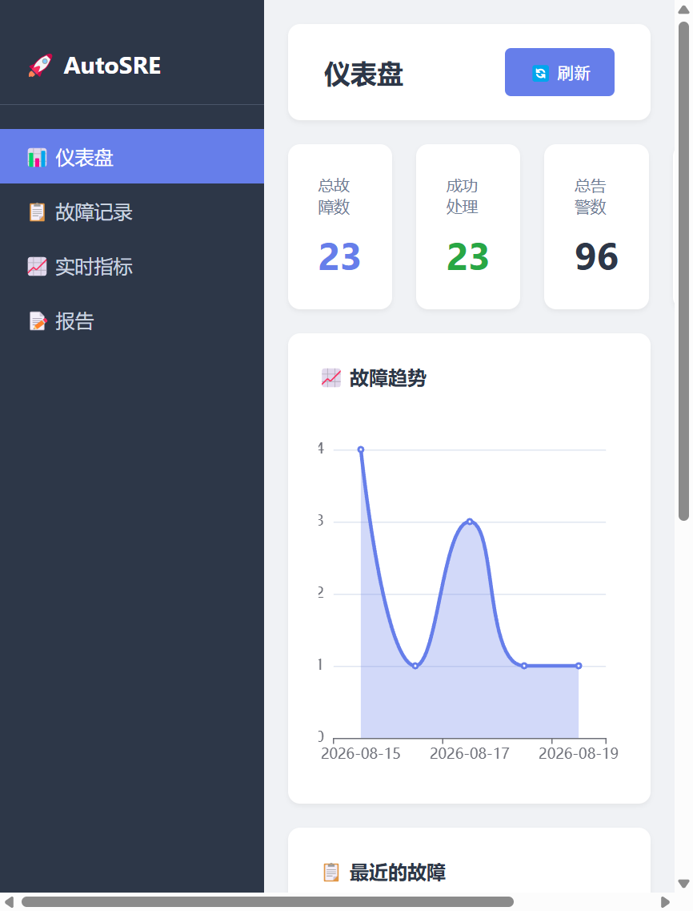

# AutoSRE - Multi-Agent Automated SRE System


> 📖 [中文版](../README.md) ｜ 📐 [Architecture](architecture.md) ｜ 🔌 [API Docs](api.md)

AutoSRE is an intelligent SRE system based on multi-agent collaboration. An Orchestrator coordinates 7 specialized agents to complete the full closed loop: alert receiving → alert convergence → root cause analysis → repair execution → report generation, enhanced with LLM deep analysis and a self-learning mechanism.

## Key Features

- 🤖 **7 Collaborative Agents** - alert convergence, log analysis, metric query, root cause inference, repair execution, report generation, predictive maintenance
- 🧠 **LLM Deep Analysis** - DeepSeek V4 Flash integration, outputting root cause / repair steps / preventive measures / risk assessment
- 📊 **Real Monitoring** - Prometheus + Docker + Alertmanager + Grafana
- 🔮 **Predictive Maintenance** - failure prediction from historical data
- 📚 **Self-Learning** - knowledge base auto-update from every incident
- 🔐 **Security** - JWT + API Key + RBAC
- ⚡ **High Performance** - 100 alerts converged in 0.0009s
- 🐳 **Docker Deployment** - 8 services orchestrated by Docker Compose

## Architecture

> See [architecture.md](architecture.md) for the full system diagram, agent collaboration sequence, and data flow.

## Quick Start

```bash
git clone https://github.com/xiaoxiaoma0201/autosre.git
cd autosre
pip install -r requirements.txt
python api_server.py
```

Web console: `http://localhost:9999`

## Fault Injection Demo

```bash
./scripts/inject_fault.sh cpu-high      # inject high CPU (30s)
./scripts/inject_fault.sh redis-down    # stop Redis
./scripts/inject_fault.sh mysql-down    # stop MySQL
./scripts/inject_fault.sh nginx-down    # stop Nginx
./scripts/inject_fault.sh redis-up      # recover (mysql-up / nginx-up likewise)
```

## Benchmark

Measured by `scripts/benchmark.py` (local environment):

| Scenario | Data size | Time |
|----------|-----------|------|
| Alert convergence | 100 alerts | 0.0009s |
| Cache write | 10000 entries | 0.0039s |
| Cache read | 10000 entries | 0.0013s |

## Web UI



The console provides dashboard (trend chart / stat cards), incident records, live metrics, and reports.

## Docs

- [Architecture](architecture.md)
- [API Docs](api.md)
- [中文版](../README.md)
