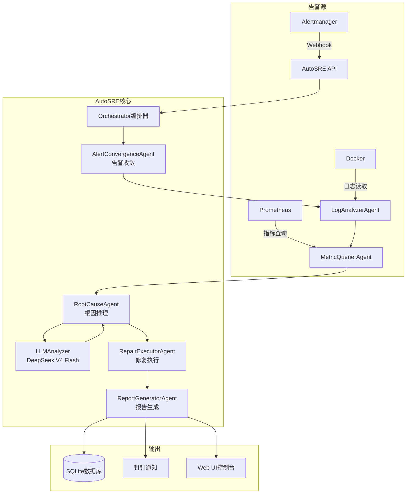
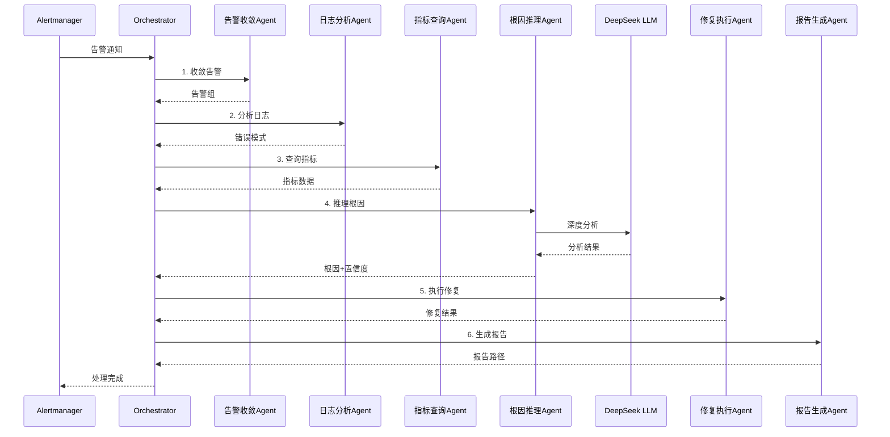
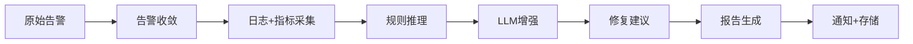

# AutoSRE 架构设计

## 系统架构图

```mermaid
graph TB
    subgraph 告警源
        A[Alertmanager] -->|Webhook| B[AutoSRE API]
        C[Prometheus] -->|指标查询| D[MetricQuerierAgent]
        E[Docker] -->|日志读取| F[LogAnalyzerAgent]
    end
    
    subgraph AutoSRE核心
        B --> G[Orchestrator编排器]
        G --> H[AlertConvergenceAgent<br/>告警收敛]
        H --> F
        F --> D
        D --> I[RootCauseAgent<br/>根因推理]
        I --> J[LLMAnalyzer<br/>DeepSeek V4 Flash]
        J --> I
        I --> K[RepairExecutorAgent<br/>修复执行]
        K --> L[ReportGeneratorAgent<br/>报告生成]
    end
    
    subgraph 输出
        L --> M[(SQLite数据库)]
        L --> N[钉钉通知]
        L --> O[Web UI控制台]
    end
```
## Agent 协作流程

```mermaid
sequenceDiagram
    participant AM as Alertmanager
    participant OR as Orchestrator
    participant AC as 告警收敛Agent
    participant LA as 日志分析Agent
    participant MQ as 指标查询Agent
    participant RC as 根因推理Agent
    participant LLM as DeepSeek LLM
    participant RE as 修复执行Agent
    participant RG as 报告生成Agent
    
    AM->>OR: 告警通知
    OR->>AC: 1. 收敛告警
    AC-->>OR: 告警组
    OR->>LA: 2. 分析日志
    LA-->>OR: 错误模式
    OR->>MQ: 3. 查询指标
    MQ-->>OR: 指标数据
    OR->>RC: 4. 推理根因
    RC->>LLM: 深度分析
    LLM-->>RC: 分析结果
    RC-->>OR: 根因+置信度
    OR->>RE: 5. 执行修复
    RE-->>OR: 修复结果
    OR->>RG: 6. 生成报告
    RG-->>OR: 报告路径
    OR-->>AM: 处理完成
```

## 数据流

```mermaid
flowchart LR
    A[原始告警] --> B[告警收敛]
    B --> C[日志+指标采集]
    C --> D[规则推理]
    D --> E[LLM增强]
    E --> F[修复建议]
    F --> G[报告生成]
    G --> H[通知+存储]
```